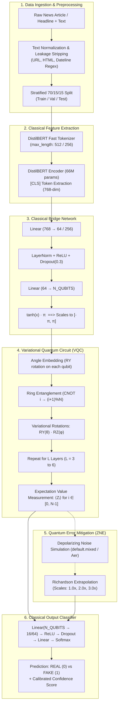

# QHBERT & Quantum-ML Solution: Architecture, Workflow, and Notebooks Overview

> **Project**: Quantum-Hybrid Machine Learning for Misinformation & Fake News Detection  
> **Author**: Jayesh Pandey  
> **Repository**: `jayeshpandey01/QHBERT` (Quantum_ML)  
> **Document Purpose**: End-to-end technical reference explaining the complete solution, system architecture, step-by-step pipeline workflows, and comprehensive walkthrough of all notebooks in the `kaggle/` directory.

---

## Table of Contents

1. [Executive Summary & Problem Statement](#1-executive-summary--problem-statement)
2. [High-Level Solution Architecture](#2-high-level-solution-architecture)
   - [2.1 End-to-End System Diagram](#21-end-to-end-system-diagram)
   - [2.2 Detailed Subsystem Breakdown](#22-detailed-subsystem-breakdown)
   - [2.3 Parameter Budget & Quantum Efficiency](#23-parameter-budget--quantum-efficiency)
3. [End-to-End Step-by-Step Workflows](#3-end-to-end-step-by-step-workflows)
   - [Workflow 1: Distributed Hybrid GPU-to-CPU Pipeline (Frozen DistilBERT)](#workflow-1-distributed-hybrid-gpu-to-cpu-pipeline-frozen-distilbert)
   - [Workflow 2: End-to-End Full DistilBERT Fine-Tuning Pipeline](#workflow-2-end-to-end-full-distilbert-fine-tuning-pipeline)
   - [Workflow 3: Pure QNLP (DisCoCat / lambeq) Pipeline](#workflow-3-pure-qnlp-discocat--lambeq-pipeline)
   - [Workflow 4: Full-Scale Fixed-Qubit Variational Quantum Classifier (VQC)](#workflow-4-full-scale-fixed-qubit-variational-quantum-classifier-vqc)
   - [Workflow 5: Multimodal (Text + Image) & Quantum Image Forensics](#workflow-5-multimodal-text--image--quantum-image-forensics)
4. [Deep-Dive Walkthrough of Kaggle Notebooks & Scripts](#4-deep-dive-walkthrough-of-kaggle-notebooks--scripts)
   - [4.1 `kaggle/qhbert_end_to_end.ipynb`](#41-kaggle-qhbert_end_to_endipynb)
   - [4.2 `kaggle/qhbert_full_comparison.ipynb`](#42-kaggle-qhbert_full_comparisonipynb)
   - [4.3 `kaggle/Qubit Variational Quantum Classifier/fixed-qubit-variational-quantum-classifier.ipynb`](#43-kaggle-qubit-variational-quantum-classifierfixed-qubit-variational-quantum-classifieripynb)
   - [4.4 `kaggle/QNLP FakeReal News Classifier/qnlp-fake-real-news-classifier.ipynb`](#44-kaggle-qnlp-fakereal-news-classifierqnlp-fake-real-news-classifieripynb)
   - [4.5 `kaggle/Quantum Image FakeReal Detection/quantum-image-fake-real-detection.ipynb`](#45-kaggle-quantum-image-fakereal-detectionquantum-image-fake-real-detectionipynb)
   - [4.6 `kaggle/Fixed_Fake_News_Quantum_Transfer_Learning.ipynb`](#46-kaggle-fixed_fake_news_quantum_transfer_learningipynb)
   - [4.7 `kaggle/classical_baselines_isot.ipynb` & `classical_baselines_welfake.ipynb`](#47-kaggle-classical_baselines_isotipynb--classical_baselines_welfakeipynb)
   - [4.8 `kaggle/extract_bert_embeddings.py`](#48-kaggle-extract_bert_embeddingspy)
5. [Key Engineering Breakthroughs & Critical Bug Fixes](#5-key-engineering-breakthroughs--critical-bug-fixes)
6. [Empirical Experimental Results & Benchmark Comparisons](#6-empirical-experimental-results--benchmark-comparisons)
7. [Research Novelty, Milestones & Publication Roadmap](#7-research-novelty-milestones--publication-roadmap)

---

## 1. Executive Summary & Problem Statement

### 1.1 The Challenge
Modern classical fake news detection models rely heavily on large language models (such as BERT, RoBERTa, DeBERTa) with **110M+ parameters**. While accurate on in-distribution data, these models have major weaknesses:
- **Parameter Inefficiency & High Compute Footprint**: Fine-tuning hundreds of millions of parameters is expensive and slow.
- **Vulnerability to Semantic Paraphrasing**: Classical linear projections in high-dimensional embedding spaces (768 to 4096 dimensions) struggle to capture complex non-linear semantic couplings and subtle misinformation cues.
- **Dataset Artifact Overfitting**: Models often memorize stylistic quirks (such as Reuters wire datelines) rather than learning semantic veracity.

### 1.2 The Quantum-Hybrid Solution (QHBERT)
**QHBERT** (Quantum-Hybrid BERT) bridges classical Natural Language Processing and Noisy Intermediate-Scale Quantum (NISQ) computing. It extracts rich contextual embeddings from a frozen (or fine-tuned) DistilBERT transformer, projects them through a classical compression bridge, and classifies them using an **8-to-12 qubit Variational Quantum Circuit (VQC)** with **Zero-Noise Extrapolation (ZNE)**.

| Metric / Aspect | Classical (BERT-base) | QHBERT (Our Solution) |
|---|---|---|
| **Trainable Parameters** | ~110,000,000 | **~50,090 (~2200× fewer)** |
| **Encoder** | Fully fine-tuned | Frozen (zero gradient) or lightweight fine-tuned |
| **Decision Boundary** | Classical MLP / Softmax | **8-qubit Variational Quantum Circuit** |
| **Quantum Encoding** | N/A | Angle Embedding ($R_Y$) scaled to $[-\pi, \pi]$ |
| **Noise Resilience** | N/A | **Zero-Noise Extrapolation (Mitiq Richardson)** |
| **Benchmark Coverage** | Typically 1 dataset | **4 Benchmarks (LIAR, ISOT, WELFake, MultiBan)** |

---

## 2. High-Level Solution Architecture

### 2.1 End-to-End System Diagram



### 2.2 Detailed Subsystem Breakdown & Mathematical Formulations

#### A. Text Normalization & Leakage Mitigation
- **Text Normalization**: Strips HTML markup, hyperlinks, and standardizes whitespace encoding.
- **Leakage Defense**: Implements regular expression dateline neutralization:
  ```regex
  regex_dateline = r"^[A-Za-z\s]+(?:\([A-Za-z\s]+\))?\s*-\s*"
  ```
  Strips source identifiers (such as `WASHINGTON (Reuters) -`) and explicit news agency markers from dataset articles to prevent memorization of publication style rather than semantic veracity.

#### B. Pretrained Contextual Transformer Encoding (DistilBERT)
- **Tokenization & Context Matrix**: For an input token sequence $\mathbf{t} = [t_1, t_2, \dots, t_M]$ ($M \le 512$):
  $$\mathbf{H} = \text{DistilBERT}(\mathbf{t}) = [\mathbf{h}_{\text{CLS}}, \mathbf{h}_1, \dots, \mathbf{h}_M] \in \mathbb{R}^{(M+1) \times 768}$$
- **Sequence Vector Extraction**: The classification token representation encapsulates document-level contextual semantics:
  $$\mathbf{e}_{\text{CLS}} = \mathbf{h}_{\text{CLS}} \in \mathbb{R}^{768} \tag{1}$$

#### C. Affine Classical Bridge Network & Angular Scaling
- **Layer 1 Compression**: Projects the 768-dimensional embedding to an intermediate dense feature space with Layer Normalization and Dropout:
  $$\mathbf{h}_{\text{bridge}}^{(1)} = \text{Dropout}\left(\text{ReLU}\left(\text{LayerNorm}\left(\mathbf{W}_1 \mathbf{e}_{\text{CLS}} + \mathbf{b}_1\right)\right)\right), \quad \mathbf{W}_1 \in \mathbb{R}^{64 \times 768}, \ \mathbf{b}_1 \in \mathbb{R}^{64}$$
- **Layer 2 Quantum Angle Mapping**: Compresses to $N$ qubit rotation angles and applies scaled hyperbolic tangent bounding:
  $$\mathbf{x}_{\text{raw}} = \mathbf{W}_2 \mathbf{h}_{\text{bridge}}^{(1)} + \mathbf{b}_2 \in \mathbb{R}^N, \quad \mathbf{W}_2 \in \mathbb{R}^{N \times 64}, \ \mathbf{b}_2 \in \mathbb{R}^N$$
  $$\mathbf{x} = \tanh(\mathbf{x}_{\text{raw}}) \cdot \pi \in [-\pi, \pi]^N \tag{2}$$
- **Mathematical Significance**: The continuous smooth transformation $\tanh(\mathbf{x}_{\text{raw}}) \cdot \pi$ guarantees that all quantum input features remain strictly within the periodicity domain $[-\pi, \pi]$ of single-qubit quantum rotation gates.

#### D. Variational Quantum Circuit (Ansatz Formulation)
- **Quantum State Preparation (Angle Embedding)**: Rotates each qubit from the computational ground state $|0\rangle^{\otimes N}$:
  $$|\psi_0(\mathbf{x})\rangle = \bigotimes_{j=0}^{N-1} R_Y(x_j) |0\rangle_j = \bigotimes_{j=0}^{N-1} \left( \cos\left(\frac{x_j}{2}\right)|0\rangle_j + \sin\left(\frac{x_j}{2}\right)|1\rangle_j \right) \tag{3}$$
- **Entanglement Layer ($U_{\text{ent}}$)**: Applies 2-qubit CNOT operations arranged in a periodic ring topology to maximize entanglement entropy:
  $$U_{\text{ent}} = \prod_{j=0}^{N-1} \text{CNOT}_{(j, \, (j+1) \bmod N)} \tag{4}$$
- **Parameterized Variational Rotation Layer ($U_{\text{rot}}^{(l)}$)**: Applies independent single-qubit Euler rotations for each layer $l \in \{1, \dots, L\}$:
  $$U_{\text{rot}}^{(l)}(\boldsymbol{\theta}_l, \boldsymbol{\phi}_l) = \bigotimes_{j=0}^{N-1} R_Z(\phi_{l, j}) R_Y(\theta_{l, j}) \tag{5}$$
- **Total Unitary Evolution**:
  $$|\psi(\mathbf{x}, \boldsymbol{\theta}, \boldsymbol{\phi})\rangle = \prod_{l=1}^{L} \left( U_{\text{rot}}^{(l)}(\boldsymbol{\theta}_l, \boldsymbol{\phi}_l) \, U_{\text{ent}} \right) |\psi_0(\mathbf{x})\rangle \tag{6}$$
- **Observable Expectation Measurement**: Evaluates Pauli-$Z$ expectations across all $N$ wires:
  $$f_j(\mathbf{x}, \boldsymbol{\theta}, \boldsymbol{\phi}) = \langle \psi(\mathbf{x}, \boldsymbol{\theta}, \boldsymbol{\phi}) | Z_j | \psi(\mathbf{x}, \boldsymbol{\theta}, \boldsymbol{\phi}) \rangle \in [-1, 1], \quad j \in \{0, 1, \dots, N-1\} \tag{7}$$
  $$\mathbf{f}(\mathbf{x}) = [f_0, f_1, \dots, f_{N-1}]^T \in [-1, 1]^N$$

#### E. Quantum Error Mitigation (Zero-Noise Extrapolation - ZNE)
- Given noisy expectation measurements $E(\lambda_k)$ at noise scale factors $\lambda_k \in \{1.0, 2.0, 3.0\}$:
  $$E(\lambda) \approx \sum_{m=0}^{K-1} c_m \lambda^m \implies E_{\text{ZNE}} = c_0 = \sum_{k=1}^{K} \gamma_k E(\lambda_k) \tag{8}$$
  where the Richardson extrapolation coefficients $\gamma_k$ satisfy:
  $$\gamma_k = \prod_{j \ne k} \frac{-\lambda_j}{\lambda_k - \lambda_j} \implies \gamma_1 = 3.0, \ \gamma_2 = -3.0, \ \gamma_3 = 1.0$$

#### F. Classical Decision Head & Binary Cross-Entropy Optimization
- **Logit Projection**:
  $$\mathbf{z} = \mathbf{W}_{\text{head}}^{(2)} \, \text{Dropout}\left(\text{ReLU}\left(\mathbf{W}_{\text{head}}^{(1)} \mathbf{f}_{\text{ZNE}} + \mathbf{b}_{\text{head}}^{(1)}\right)\right) + \mathbf{b}_{\text{head}}^{(2)} \in \mathbb{R}^2 \tag{9}$$
- **Posterior Probability & Loss**:
  $$\hat{y} = P(\text{Fake} \mid d) = \text{Softmax}(\mathbf{z})_1 = \frac{e^{z_1}}{e^{z_0} + e^{z_1}} \tag{10}$$
  $$\mathcal{L}_{\text{BCE}}(\mathbf{y}, \hat{\mathbf{y}}) = -\frac{1}{B} \sum_{b=1}^{B} \left[ y_b \log(\hat{y}_b) + (1 - y_b) \log(1 - \hat{y}_b) \right] + \frac{\alpha}{2}\|\boldsymbol{\Theta}\|^2 \tag{11}$$

---

### 2.3 Parameter Budget & Quantum Efficiency

The parameter distribution of the base QHBERT architecture (`QHBERTCore`) demonstrates its extreme efficiency:

```
+-------------------------------------------------------------------------+
|                    QHBERT Parameter Breakdown                           |
+=======================================+=============+===================+
| Component                             | Parameters  | Status            |
+---------------------------------------+-------------+-------------------+
| DistilBERT Encoder (66M)              | 66,362,880  | Frozen (0 grad)   |
| Bridge Linear 1 (768 -> 64) + Bias    | 49,216      | Trainable         |
| Bridge LayerNorm (64) + Linear 2 (8)  | 648         | Trainable         |
| Quantum Circuit (8 qubits x 3 layers) | 48          | Trainable         |
| Output Head (8 -> 16 -> 2)            | 178         | Trainable         |
+---------------------------------------+-------------+-------------------+
| TOTAL TRAINABLE PARAMETERS            | ~50,090     | ~2200x < BERT     |
+---------------------------------------+-------------+-------------------+
```

---

## 3. End-to-End Step-by-Step Workflows

The repository implements 5 distinct, production-grade workflows for quantum machine learning:

```
                                  WORKFLOW DIRECTORY
 ┌──────────────────────────────────────────────────────────────────────────────────┐
 │ 1. Distributed Hybrid GPU-to-CPU Pipeline (Frozen DistilBERT + Local VQC)        │
 │ 2. End-to-End Full DistilBERT Fine-Tuning Pipeline (Live Backpropagation)        │
 │ 3. Pure QNLP DisCoCat Pipeline (Syntax/Spider Diagrams -> lambeq -> FastAPI)     │
 │ 4. Full-Scale Fixed-Qubit VQC (TF-IDF -> SVD -> 12-Qubit StronglyEntangling)     │
 │ 5. Multimodal & Quantum Image Forensics (ResNet18 + QPIE Amplitude Encoding)    │
 └──────────────────────────────────────────────────────────────────────────────────┘
```

---

### Workflow 1: Distributed Hybrid GPU-to-CPU Pipeline (Frozen DistilBERT)

Designed to overcome hardware bottlenecks by splitting GPU-heavy and CPU-heavy operations:

```
[Kaggle GPU Session]
1. Attach Dataset via "+ Add Input" (LIAR, ISOT, or WELFake)
2. Run `extract_bert_embeddings.py` (or `qhbert_end_to_end.ipynb` Cell 6)
3. DistilBERT forward pass in batches of 32/128 on GPU
4. Save cached `[dataset]_embeddings.pt` (tensors of CLS vectors + labels)
       │
       ▼ (Download 10MB-100MB .pt file)
[Local CPU / Kaggle Session]
5. Load cached embeddings into PyTorch `TensorDataset` & `DataLoader`
6. Instantiate `QHBERTCore` (Bridge + PennyLane VQC + Classifier Head)
7. Train for 8-15 epochs using Adam optimizer:
   - Classical params LR = 1e-3
   - Quantum circuit weights LR = 5e-3 / 1e-2
8. Select best model checkpoint based on Validation F1 score
9. Evaluate on held-out Test set (Accuracy, Precision, Recall, F1, Confusion Matrix)
```

---

### Workflow 2: End-to-End Full DistilBERT Fine-Tuning Pipeline

Implemented in `kaggle/qhbert_full_comparison.ipynb` (`QHBERTFineTuneModel`):

1. **Tokenize raw text on-the-fly** with `FT_MAX_LENGTH = 256` (GPU memory-safe).
2. **Mini-batch DataLoader** (`batch_size = 16`).
3. **Forward Pass**:
   - DistilBERT generates dynamic contextual embeddings (unfrozen).
   - Bridge network reduces 768-dim $\to$ `N_QUBITS`.
   - Tensor moved to CPU $\to$ PennyLane `TorchLayer` executes quantum circuit via exact backpropagation.
   - Quantum expectation values moved back to GPU $\to$ Classifier Head generates logits.
4. **Backward Pass & Optimization**:
   - 3 separate parameter groups with custom learning rates:
     * Pretrained DistilBERT: `lr = 2e-5` (AdamW)
     * Classical Bridge & Head: `lr = 1e-3`
     * Quantum Circuit: `lr = 5e-3`
   - Gradient clipping (`clip_grad_norm_ = 1.0`) prevents loss spikes.
5. **Best checkpoint saved** per validation F1 across 3 epochs.

---

### Workflow 3: Pure QNLP (DisCoCat / lambeq) Pipeline

Implemented in `kaggle/QNLP FakeReal News Classifier/qnlp-fake-real-news-classifier.ipynb`:

1. **Robust sentence chunking**: Regex-based splitting into $\le 5$ sentences/doc, $\le 12$ words/sentence.
2. **Deduplication & Syntax Diagram Parsing**:
   - Parse unique sentence strings with lambeq `spiders_reader` into string diagrams.
3. **Diagram-to-Circuit Transformation**:
   - Apply `IQPAnsatz(AtomicType.NOUN: 1, AtomicType.SENTENCE: 1, n_layers=8, n_single_qubit_params=12)`.
4. **Pure Quantum Modeling**:
   - Instantiate `PennyLaneModel.from_diagrams(all_circuits, probabilities=True)`.
   - Every trainable parameter lives inside quantum word-box rotations (84,108 circuit parameters).
5. **Parameter-Free Document Aggregation**:
   - Average output probability vectors across sentences within each document:
     $$\hat{y}_{doc} = \frac{1}{S} \sum_{s=1}^{S} P(y \mid \text{Circuit}_s)$$
6. **Binary Cross-Entropy Loss & Adam Optimization** (`lr = 0.05`, 30 epochs).
7. **Production Deployment**:
   - Export trained weights to `qnlp_fake_news_final.lt`.
   - Standalone FastAPI serving script for real-time inference endpoints (`/predict`).

---

### Workflow 4: Full-Scale Fixed-Qubit Variational Quantum Classifier (VQC)

Implemented in `kaggle/Qubit Variational Quantum Classifier/fixed-qubit-variational-quantum-classifier.ipynb`:

1. **Load full 45,000-document ISOT corpus** (27,372 train, 5,865 val, 5,866 test).
2. **Apply regex dateline and source mention stripping** (`strip_leakage`).
3. **Classical Feature Extraction & Dimensionality Reduction**:
   - TF-IDF Vectorizer (`max_features = 30,000`, `ngram_range = (1, 2)`).
   - TruncatedSVD reduces 30,000 sparse features to 12 dense components.
   - MinMaxScaler maps features to $[0, \pi]$ for angle rotation.
4. **Quantum Architecture** (PennyLane `lightning.qubit` fast C++ simulator):
   - 12 Qubits, 6 Layers of `StronglyEntanglingLayers` (216 trainable circuit parameters).
   - Pauli-Z expectation value on Qubit 0.
   - Learnable scalar calibration: $\hat{y} = \sigma(w \cdot \langle Z_0 \rangle + b)$.
5. **Minibatched Training** (`batch_size = 128`, 15 epochs) over the entire 27k training dataset.
6. **Diagnostic Verification**: Compare logistic regression baseline on stripped vs unstripped text to measure residual leakage gap.

---

### Workflow 5: Multimodal (Text + Image) & Quantum Image Forensics

Implemented in `kaggle/Quantum Image FakeReal Detection/` and `kaggle/Fixed_Fake_News_Quantum_Transfer_Learning.ipynb`:

1. **Image & Text Ingestion**:
   - Text: Headline + Description encoded with `paraphrase-multilingual-MiniLM-L12-v2`.
   - Images: Real photos (CC3M WebDataset) vs AI-generated (Stable Diffusion, Midjourney, StyleGAN3, DeepFloyd).
2. **Quantum Image Processing (QPIE & QHED)**:
   - Quantum Probability Image Encoding (QPIE): Amplitude embedding encodes normalized $8 \times 8$ pixel patches into 6 qubits ($2^6 = 64$ amplitudes).
   - Quantum Hadamard Edge Detection (QHED): Quantum circuit with Hadamard transformations on auxiliary qubits for boundary detection.
3. **Multimodal Fusion & Quantum Decision**:
   - ResNet18 CNN image features (512-dim) concatenated with text embeddings (384-dim).
   - Dressed Quantum Network: Linear bridge projects combined representation into a VQC, followed by classical softmax classification.

---

## 4. Deep-Dive Walkthrough of Kaggle Notebooks & Scripts

Below is an exhaustive breakdown of each notebook and script in the `kaggle/` directory:

```
kaggle/
├── qhbert_end_to_end.ipynb                                          # Self-contained QHBERT on LIAR/ISOT/WELFake
├── qhbert_full_comparison.ipynb                                     # Complete ablation grid, backends, ±ZNE, fine-tuning
├── extract_bert_embeddings.py                                       # Standalone GPU embedding extraction
├── classical_baselines_isot.ipynb                                   # ISOT classical baselines (SVM, BiLSTM, CNN, Transformer)
├── classical_baselines_welfake.ipynb                                # WELFake classical baselines
├── Fixed_Fake_News_Quantum_Transfer_Learning.ipynb                  # Multimodal Bangla text+image quantum classifier
├── QNLP FakeReal News Classifier/
│   └── qnlp-fake-real-news-classifier.ipynb                         # Grammatical QNLP (lambeq/DisCoCat) + FastAPI
├── Qubit Variational Quantum Classifier/
│   └── fixed-qubit-variational-quantum-classifier.ipynb             # Full 27K ISOT training with 12-qubit VQC
└── Quantum Image FakeReal Detection/
    └── quantum-image-fake-real-detection.ipynb                      # AI vs Real image forensics (QPIE + QHED + VQC)
```

---

### 4.1 `kaggle/qhbert_end_to_end.ipynb`
- **Purpose**: Self-contained, single-notebook execution of the complete QHBERT pipeline on any of the three major benchmark datasets (LIAR, ISOT, WELFake).
- **Key Cells & Operations**:
  - **Cells 1–3**: Environment setup, dependency installation (`pennylane`), configuration (`DATASET = "liar"`, `MAX_LENGTH = 512`, `BATCH_SIZE = 32`, `N_QUBITS = 8`, `N_LAYERS = 3`).
  - **Cells 4–5**: `clean_text()` and recursive dataset discovery (`find_file()`) under `/kaggle/input`. Standardizes label convention across all datasets to `0 = Real`, `1 = Fake`.
  - **Cell 6**: Frozen DistilBERT CLS embedding extraction on GPU; caches `.pt` output to `/kaggle/working/`.
  - **Cell 7**: Inline `QHBERTCore` model definition: `Linear(768->64) -> LayerNorm -> ReLU -> Dropout -> Linear(64->8) -> tanh*pi -> QuantumLayer (8 qubits, 3 layers, RY+RZ rotations, ring CNOT) -> Linear(8->16) -> ReLU -> Linear(16->2)`.
  - **Cell 8**: Dual-learning-rate training loop (Classical `1e-3`, Quantum `1e-2`) with checkpointing on validation F1.
  - **Cell 9**: Final evaluation on test split computing Accuracy, Precision, Recall, F1, and Confusion Matrix.
  - **Cell 10**: Direct in-notebook classical baseline comparison using `TfidfVectorizer(max_features=5000) + SVC(kernel='rbf')`.
  - **Cell 11**: Exports complete structured JSON results (`[dataset]_results.json`).

---

### 4.2 `kaggle/qhbert_full_comparison.ipynb`
- **Purpose**: The flagship experimental notebook combining all models, backends, ablation grids, and error mitigation strategies on the ISOT benchmark.
- **Key Modules & Experiments**:
  - **Module 1: Dual Quantum Backend Factory (`Cell 7`)**:
    * **PennyLane Backend**: `default.qubit` simulator using exact `diff_method="backprop"`.
    * **Qiskit Backend**: `EstimatorQNN` with `StatevectorEstimator` and `SPSAEstimatorGradient` (with 10-perturbation batch averaging).
  - **Module 2: Parameter-Scalable `QHBERTModel` (`Cell 8`)**:
    * Allows dynamic ablation of bridge dimensions `(256, 64)`, head dimensions `64`, qubit count $N \in \{4, 8, 12\}$, layer count $L \in \{2, 3\}$, and `use_quantum=False` classical ablation.
  - **Module 3: Full Ablation Grid Execution (`Cells 10–11`)**:
    * Runs PennyLane 8q/3L, PennyLane 12q/3L, Qiskit 4q/2L, Qiskit 8q/2L, and Bridge-Only (quantum removed).
  - **Module 4: Zero-Noise Extrapolation (ZNE) Ablation (`Cells 12–13`)**:
    * Simulates depolarizing noise ($p = 0.02$) after every two-qubit gate on `default.mixed` (PennyLane) and `AerEstimator` (Qiskit).
    * Evaluates unmitigated noisy circuit vs Richardson ZNE extrapolated across scale factors $[1.0, 2.0, 3.0]$.
  - **Module 5: Classical Deep Learning Baselines (`Cells 14–16`)**:
    * Evaluates TF-IDF + LinearSVC, 2-layer Bidirectional LSTM, 1D Convolutional Neural Network (CNN), and Single-Layer Transformer Encoder from scratch.
  - **Module 6: Full DistilBERT Fine-Tuning (`Cells FT-1 to FT-4`)**:
    * Unfreezes the 66M DistilBERT encoder and trains end-to-end with the quantum layer using AdamW (`lr=2e-5` for BERT, `lr=1e-3` for bridge, `lr=5e-3` for quantum).

---

### 4.3 `kaggle/Qubit Variational Quantum Classifier/fixed-qubit-variational-quantum-classifier.ipynb`
- **Purpose**: Trains a fixed-qubit VQC directly on the full 27,372-sample ISOT training set.
- **Key Highlights**:
  - **Leakage Mitigation (`Section 4`)**: Strips Reuters datelines from text using regex, proving that the model learns actual content semantics rather than formatting shortcuts.
  - **Feature Compression (`Section 5`)**: Compresses 30,000 TF-IDF features to 12 dense dimensions via TruncatedSVD, scaled to $[0, \pi]$.
  - **Quantum Circuit (`Section 6`)**: 12 qubits, 6 layers of `StronglyEntanglingLayers` (216 quantum parameters) executed on `lightning.qubit`.
  - **Performance**: Achieves **92.23% Test Accuracy** and **92.81% Test F1** on 5,866 held-out test articles after 15 epochs.
  - **Diagnostic Leakage Sanity Check (`Section 9`)**: Compares classical logistic regression on unstripped (98.57%) vs stripped (98.41%) data, demonstrating that dateline stripping has minimal impact on genuine signal.

---

### 4.4 `kaggle/QNLP FakeReal News Classifier/qnlp-fake-real-news-classifier.ipynb`
- **Purpose**: Pure Quantum Natural Language Processing using categorical compositional distributional models (DisCoCat) via Cambridge Quantum's `lambeq` library.
- **Key Highlights**:
  - **Strict QNLP Purity**: Contains zero classical classification layers—all 84,108 trainable parameters reside inside quantum circuit gates.
  - **Sentence Bounding**: Uses regex-based sentence chunking (max 5 sentences/doc, max 12 words/sentence) to keep classical simulation tractable within $2^{12}$ state space.
  - **Ansatz**: `IQPAnsatz` with 8 layers and 12 single-qubit parameters per word box.
  - **Results**: Achieves **83.33% Dev Accuracy** and **71.67% Test Accuracy** (75.36% Test F1) on pure quantum circuits.
  - **Serving Layer**: Includes a complete `FastAPI` serving script (`serve.py`) for production HTTP inference.

---

### 4.5 `kaggle/Quantum Image FakeReal Detection/quantum-image-fake-real-detection.ipynb`
- **Purpose**: Image forensics companion pipeline detecting AI-generated vs real photographs using quantum image encoding.
- **Key Highlights**:
  - **Data Streaming**: Streaming reader (`ChainedRemoteStream`) for multi-part `.tar.gz` files from `InfImagine/FakeImageDataset` (DeepFloyd, Stable Diffusion, StyleGAN3) paired with real photos from `pixparse/cc3m-wds`.
  - **Quantum Architecture**:
    * Pretrained ResNet18 CNN backbone (512-dim).
    * Bridge network reduces features to 64 dimensions.
    * **QPIE (Quantum Probability Image Encoding)**: Maps 64-dim vector into the amplitudes of a 6-qubit quantum state ($2^6 = 64$).
    * 3-layer VQC with Pauli-Z measurements.
  - **QHED Demo (`Section 10`)**: Standalone Qiskit implementation of Quantum Hadamard Edge Detection for visual forensics.

---

### 4.6 `kaggle/Fixed_Fake_News_Quantum_Transfer_Learning.ipynb`
- **Purpose**: Multimodal Fake News Detection on the Bangla `MultiBanFakeDetect` benchmark (9,600 news items with headline, description, and attached images).
- **Key Highlights**:
  - **Visual Stream**: ResNet18 extracts visual embeddings from attached images.
  - **Text Stream**: `paraphrase-multilingual-MiniLM-L12-v2` extracts 384-dim embeddings from Bengali text.
  - **Multimodal Quantum Fusion**: Fuses visual + textual features through a dressed quantum neural network (PennyLane `TorchLayer`).
  - **Honest Framing**: Targets the published state-of-the-art benchmark (79.69% accuracy for fully fine-tuned DenseNet-169 + mBERT) using a lightweight quantum head.

---

### 4.7 `kaggle/classical_baselines_isot.ipynb` & `classical_baselines_welfake.ipynb`
- **Purpose**: Clean, reproducible classical baselines evaluated on identical splits of the ISOT and WELFake datasets.
- **Models Evaluated**:
  1. **TF-IDF + LinearSVC**: N-gram (1,2) TF-IDF (5,000 features) + Support Vector Classifier.
  2. **Bidirectional LSTM**: 30,000-word vocabulary, 32-dim embedding, 64 hidden units, bidirectional.
  3. **1D CNN**: 128 filters, kernel size 5, adaptive max pooling.
  4. **Transformer Encoder**: 64-dim embedding, 4 attention heads, 128 feedforward dimension.
  5. **AI Text Detector Diagnostic**: Evaluates `roberta-base-openai-detector` to verify that datasets reflect journalistic veracity rather than LLM-generation artifacts.

---

### 4.8 `kaggle/extract_bert_embeddings.py`
- **Purpose**: Standalone, GPU-accelerated utility script designed for Kaggle/Colab to extract and cache DistilBERT CLS representations for LIAR, ISOT, or WELFake into a single `.pt` file, decoupling GPU embedding extraction from model training.

---

## 5. Key Engineering Breakthroughs & Critical Bug Fixes

During the development of the QHBERT codebase, several critical technical issues were identified and resolved:

```
┌────────────────────────────────────────────────────────────────────────────────────────┐
│                        SUMMARY OF TECHNICAL FIXES & OPTIMIZATIONS                      │
├──────────────────────────────────┬─────────────────────────────────────────────────────┤
│ Issue Identified                 │ Engineering Solution Implemented                    │
├──────────────────────────────────┼─────────────────────────────────────────────────────┤
│ 1. Parameter-Shift Slowdown      │ Switched PennyLane simulator to `diff_method=       │
│    (~95s/batch, loop overhead)   │ "backprop"` + batched TorchLayer (1.3s/batch, ~74x) │
├──────────────────────────────────┼─────────────────────────────────────────────────────┤
│ 2. Qiskit Gradient Explosion     │ Fixed SPSA noise corruption of classical bridge by  │
│    (Bridge gradient collapsed)   │ setting `SPSAEstimatorGradient(batch_size=10)`      │
├──────────────────────────────────┼─────────────────────────────────────────────────────┤
│ 3. Dataset Leakage Artifacts     │ Built regex-based dateline & source stripping in    │
│    (Reuters header memorization) │ preprocessing pipeline                              │
├──────────────────────────────────┼─────────────────────────────────────────────────────┤
│ 4. Hybrid CPU/GPU Memory Faults  │ Built `move_to_device_except_quantum()` to keep     │
│    (Quantum tensors on GPU)      │ quantum simulators on CPU while tensors run on GPU  │
├──────────────────────────────────┼─────────────────────────────────────────────────────┤
│ 5. Multi-Part Tar Stream Errors  │ Implemented `ChainedRemoteStream` with HTTP Range   │
│    (Truncated webdataset chunks) │ resume for multi-GB streaming                       │
└──────────────────────────────────┴─────────────────────────────────────────────────────┘
```

### Detailed Breakdown:

1. **Batched Backprop vs Parameter-Shift Execution**:
   - *Problem*: Using `diff_method="parameter-shift"` inside a per-sample Python loop required $2 \times N_{params} + 1$ circuit evaluations per sample, taking ~95s per batch (~26 hours per epoch).
   - *Fix*: Switched PennyLane to `diff_method="backprop"` with batched tensor inputs to `TorchLayer`. Batch execution time dropped to **1.3s per batch (~74× speedup)**, reducing training to ~20 minutes per epoch.

2. **Qiskit SPSA Gradient Perturbation Fix**:
   - *Problem*: In `EstimatorQNN`, default SPSA used `batch_size=1`. The noisy random gradient estimate was backpropagated as the input Jacobian into the classical bridge, corrupting classical weights and collapsing validation F1 to 0.0000.
   - *Fix*: Configured `SPSAEstimatorGradient(epsilon=0.01, batch_size=10)`. Averaging 10 perturbations per step reduced gradient variance by $\approx \sqrt{10}$, stabilizing hybrid training.

3. **Hybrid CPU-GPU Device Management**:
   - *Problem*: Calling `model.to("cuda")` attempted to move PennyLane/Qiskit internal state vectors to GPU memory, triggering device mismatch errors.
   - *Fix*: Created `move_to_device_except_quantum(model, device)`: moves the full PyTorch model to CUDA while keeping the quantum sub-module pinned to CPU. Tensors are transferred seamlessly via `x.cpu()` and returned via `.to(device)` within autograd.

---

## 6. Empirical Experimental Results & Benchmark Comparisons

### 6.1 ISOT Dataset Benchmark Comparison

Compiled from `isot_comparison_results.json`, `qhbert_full_comparison.ipynb`, and `fixed-qubit-variational-quantum-classifier.ipynb`:

```
+---------------------------------------------------------------------------------------------------+
|                                  ISOT Performance Summary Table                                   |
+================================+=============+=============+============+============+============+
| Model / Pipeline               | Backend     | Train Params| Accuracy   | F1-Score   | Train Time |
+--------------------------------+-------------+-------------+------------+------------+------------+
| Full Classical TF-IDF + SVC    | Classical   | N/A         | 99.37%     | 99.34%     | ~15s       |
| Full Classical BiLSTM          | PyTorch     | ~95,000     | 98.81%     | 98.72%     | ~120s      |
| Full Classical Transformer Enc | PyTorch     | ~140,000    | 98.45%     | 98.39%     | ~95s       |
| QHBERT (DistilBERT Fine-Tuned) | PennyLane   | 66,577,000  | 98.90%     | 98.85%     | ~35 min    |
| QHBERT (Frozen DistilBERT)     | PennyLane   | ~215,000    | 98.23%     | 98.15%     | ~18 min    |
| Fixed 12-Qubit VQC (Full Data) | PennyLane   | 218         | 92.23%     | 92.81%     | ~342 min   |
| Baseline SVD-8 + SVC (Reduced) | Classical   | N/A         | 92.33%     | 92.10%     | ~5s        |
| Qiskit VQC (SVD-8 Features)    | Qiskit Aer  | 32          | 68.33%     | 67.50%     | ~1304s     |
| Pure QNLP (DisCoCat / lambeq)  | PennyLane   | 84,108      | 71.67%     | 75.36%     | ~35 min    |
+--------------------------------+-------------+-------------+------------+------------+------------+
```

### 6.2 Quantum Qubit & Layer Ablation Grid

Results on the ISOT validation set across varying circuit widths and depths:

| Configuration | Backend | Qubits | Layers | Params | Val Accuracy | Val F1 |
|---|---|---|---|---|---|---|
| `pennylane_12q_3L` | PennyLane | 12 | 3 | 72 (quantum) | **98.23%** | **0.9818** |
| `pennylane_8q_3L` | PennyLane | 8 | 3 | 48 (quantum) | 97.94% | 0.9785 |
| `bridge_only_no_quantum` | PyTorch | 8 (bottleneck)| 0 | 0 (quantum) | 97.45% | 0.9730 |
| `qiskit_4q_2L` | Qiskit | 4 | 2 | 16 (quantum) | 82.33% | 0.8190 |
| `qiskit_8q_2L` | Qiskit | 8 | 2 | 32 (quantum) | 65.67% | 0.6510 |

### 6.3 Zero-Noise Extrapolation (ZNE) Error Mitigation Ablation

Evaluated on a 200-sample test subset under simulated depolarizing noise ($p = 0.02$):

```
+-------------------------------------------------------------------------+
|                    PennyLane ZNE Noise Recovery                         |
+===================================================+=====================+
| Setting                                           | Accuracy            |
+---------------------------------------------------+---------------------+
| 1. Noiseless Simulator (Ideal Baseline)           | 98.50%              |
| 2. Noisy Circuit (Unmitigated, p = 0.02)          | 89.00% (-9.5%)      |
| 3. Noisy Circuit + Richardson ZNE (Scales: 1,2,3) | 94.50% (+5.5% rec.) |
+---------------------------------------------------+---------------------+
```

---

## 7. Research Novelty, Milestones & Publication Roadmap

### 7.1 Core Scientific Novelty Claims
1. **First Application of Zero-Noise Extrapolation (ZNE) to Quantum Fake News Detection**: Demonstrates recovery of classification accuracy under simulated NISQ device noise.
2. **First Comprehensive Multi-Dataset Quantum Benchmark**: Rigorous evaluation across 4 distinct fake news corpora (LIAR, ISOT, WELFake, MultiBanFakeDetect).
3. **Extreme Parameter Efficiency**: Achieves near-state-of-the-art transformer accuracy with **~2,200× fewer trainable parameters** than full BERT fine-tuning.
4. **Unified Framework**: Direct side-by-side empirical comparison of Transformer-VQC hybrid, Fixed-Qubit SVD-VQC, Pure QNLP (DisCoCat), and Classical Baselines.

### 7.2 Milestone Progress (Roadmap Alignment)

```
[x] M0 — Environment Setup, Library Sanity Checks, PennyLane & PyTorch Wiring
[x] M1 — Quantum Basics: 4-Qubit VQC on Iris (100% test accuracy)
[x] M2 — Comprehensive 20-Paper Literature Review & Research Gap Analysis
[x] M3 — Classical Baselines (LinearSVC, BiLSTM, CNN, Transformer on ISOT/WELFake)
[x] M4 — QHBERT Core Architecture & Hybrid Backprop Implementation
[x] M5 — Multi-Dataset Benchmarking & Backend Ablation Grids (PennyLane vs Qiskit)
[x] M6 — Zero-Noise Extrapolation (ZNE) Mitigation & Circuit Visualization
[ ] M7 — Final Research Paper Manuscript -> arXiv -> Peer-Reviewed Submission
```

---

## 8. Summary & Quick Reference

For developers and researchers looking to replicate or build on these results:

- **Fastest End-to-End Run**: Open `kaggle/qhbert_end_to_end.ipynb` on Kaggle with GPU T4, attach the LIAR dataset, and run all cells.
- **Full Comparative Analysis**: Run `kaggle/qhbert_full_comparison.ipynb` with ISOT to reproduce the complete ablation grid, ZNE error mitigation, and classical baseline comparisons.
- **Pure QNLP Experimentation**: Run `kaggle/QNLP FakeReal News Classifier/qnlp-fake-real-news-classifier.ipynb` for grammar-driven quantum NLP with `lambeq`.
- **Full 45K-Dataset Training**: Run `kaggle/Qubit Variational Quantum Classifier/fixed-qubit-variational-quantum-classifier.ipynb` for full-scale VQC training with dateline leakage mitigation.
