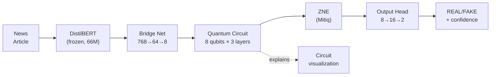
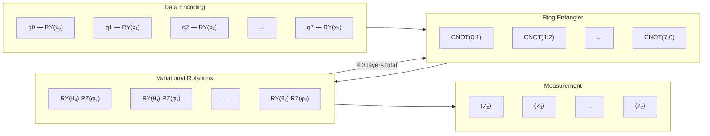

<div align="center">

# QHBERT

### Quantum-Hybrid BERT for Fake News Detection

*A noise-mitigated hybrid quantum-classical transformer, evaluated across four fake-news benchmarks.*


[Overview](#overview) •
[Architecture](#architecture) •
[Getting Started](#getting-started) •
[Roadmap](#roadmap) •
[Research Basis](#research-basis)

</div>

---

## Overview

Classical fake-news detectors (BERT, RoBERTa, etc.) are accurate but expensive —
110M+ parameters, brittle to paraphrasing, and blind to the kind of subtle
linguistic entanglement misinformation exploits. **QHBERT** replaces the final
classification stage of a frozen DistilBERT encoder with a small variational
quantum circuit, cutting trainable parameters by **~2200×** while targeting
competitive accuracy.

| | Classical (BERT-base) | QHBERT |
|---|---|---|
| Trainable parameters | 110M | **~50K** |
| Encoder | Fine-tuned | Frozen (no gradient) |
| Classification stage | Dense layers | 8-qubit variational circuit |
| Noise handling | N/A | Zero-Noise Extrapolation (Mitiq) |
| Datasets evaluated | Typically 1 | LIAR, FakeNewsNet, ISOT, WELFake |

This is the quantum successor to an earlier classical baseline:
**[jayeshpandey01/fake_news](https://github.com/jayeshpandey01/fake_news)**
— kept as Baseline 3 in the eventual paper's results table.

### Novelty claims

1. First application of **Zero-Noise Extrapolation** to quantum fake-news detection
2. First **multi-dataset** quantum benchmark (4 datasets) for this task
3. Quantum circuit visualization as a descriptive explainability aid
4. Competitive accuracy at **~2200× fewer** trainable parameters than BERT-base

Full literature review (20 papers) and research-gap analysis:
[qhbert_papers_detailed_reference.md](qhbert_papers_detailed_reference.md).
Complete milestone plan: [implementation_milestone.md](implementation_milestone.md).

---

## Architecture

### End-to-end pipeline



| Stage | What happens |
|---|---|
| DistilBERT (frozen) | Tokenize (max_length 512) → 66M-param forward pass → take the CLS embedding (768-dim). No gradient. |
| Bridge network | `Linear(768→64) → LayerNorm → ReLU → Dropout → Linear(64→8) → tanh(x)·π` — scales to `[-π, π]` for angle encoding. |
| Quantum circuit | `AngleEmbedding` (RY) → 3× [ring CNOT entangler → RY/RZ rotations] → measure `⟨Zᵢ⟩` on all 8 qubits. |
| ZNE (Mitiq) | Runs the circuit at noise ×1, ×2, ×3 and Richardson-extrapolates to a zero-noise estimate. |
| Output head | `Linear(8→16) → ReLU → Dropout → Linear(16→2) → Softmax`. |

### Quantum circuit ansatz (one layer of three)



| Design choice | Reason |
|---|---|
| Angle embedding | Natural fit for small classical feature vectors → qubit rotations |
| Ring CNOT topology | Matches IBM Eagle connectivity; avoids costly SWAP gates |
| 3 layers | Enough expressivity while avoiding barren plateaus at low depth |
| RY + RZ per qubit | 2 degrees of freedom per qubit for near-maximal expressibility |
| Pauli-Z measurement | Maps each qubit to [-1, +1] for the classical head |

### Component parameter budget

| Component | Technology | Parameters | Trainable? |
|---|---|---|---|
| Tokenizer | DistilBERT-base-uncased | 0 | — |
| Encoder | DistilBERT | 66M | ❌ frozen |
| Bridge network | Linear + LayerNorm | ~49,864 | ✅ |
| Quantum circuit | PennyLane, 8 qubits × 3 layers | 48 | ✅ |
| Error mitigation | Mitiq ZNE | 0 | — |
| Output head | Linear | 178 | ✅ |
| **Total trainable** | | **~50,090** | vs. BERT's 110M → **~2200× smaller** |

Verified directly by [tests/test_model.py](tests/test_model.py) (`test_qhbert_core_param_count`).

---

## Project layout

```
Quantum_ML/
├── src/
│   ├── models/          # QHBERTCore, QHBERTFull, quantum circuit, bridge network
│   ├── data/            # text cleaning / preprocessing
│   ├── training/        # training loop (runs on cached embeddings, CPU-friendly)
│   ├── mitigation/       # Zero-Noise Extrapolation (Mitiq)
│   └── explain/         # quantum circuit visualization
├── kaggle/
│   └── extract_bert_embeddings.py   # run on Kaggle GPU, caches embeddings only
├── milestones/           # one script/notebook per milestone (M0, M1, ...)
├── tests/                # unit tests for the model stack
├── experiments/          # per-dataset results (gitignored)
└── paper/                # write-up, figures, references
```

## How local + Kaggle split the work

DistilBERT is frozen, so its embeddings only need to be computed **once**.
That step is the only GPU-heavy, dataset-heavy part of the pipeline — everything
else is a ~50K-parameter model that trains fine on a CPU.

1. **Kaggle** (free GPU, no manual downloads): attach a dataset via *+ Add Input*,
   run [`kaggle/extract_bert_embeddings.py`](kaggle/extract_bert_embeddings.py),
   download the single resulting `.pt` file of cached embeddings.
2. **Local** (this repo): train the quantum+classical stack on those cached
   embeddings — no raw dataset ever touches local disk.

## Getting started

```bash
python -m venv .venv
.venv\Scripts\python.exe -m pip install -r requirements.txt

# Milestone 0 — verify quantum + torch + model wiring
.venv\Scripts\python.exe milestones\00_environment_test.py

# Milestone 1 — first working VQC (Iris dataset, no downloads needed)
.venv\Scripts\python.exe milestones\01_quantum_basics_iris_vqc.py

# Unit tests
.venv\Scripts\python.exe -m pytest tests\ -v

# Train on cached embeddings (produced via the Kaggle script above)
.venv\Scripts\python.exe -m src.training.train --embeddings path\to\liar_embeddings.pt
```

---

## Roadmap

- [x] **M0** — Environment setup & quantum circuit sanity check
- [x] **M1** — VQC on Iris (100% accuracy, target was >85%)
- [ ] **M2** — Literature review write-up
- [ ] **M3** — Classical baselines (TF-IDF+SVM, DistilBERT fine-tune)
- [x] **M4** — QHBERT architecture (forward + backward pass verified)
- [ ] **M5** — Training across all 4 datasets + ablations
- [ ] **M6** — ZNE integration + circuit-visualization explainability
- [ ] **M7** — Paper draft → arXiv → conference/journal submission

Full breakdown with datasets, ablations, and benchmarking plan:
[implementation_milestone.md](implementation_milestone.md).

---

## Research basis

QHBERT's design decisions are grounded in a 20-paper review spanning QML
foundations (Biamonte et al., Havlíček et al.), direct competition in
quantum fake-news detection (HQDNN, PegasosQSVM, QEMF, QCNN-MFND), QNLP
methods (DisCoCat, lambeq, quantum self-attention), and classical baselines
(BERT, RoBERTa). See
[qhbert_papers_detailed_reference.md](qhbert_papers_detailed_reference.md)
for the full per-paper breakdown and how each shaped QHBERT's architecture.

---

## Author

**Jayesh Pandey**

## License

All rights reserved — see [LICENSE](LICENSE). This repository is public for
visibility during active research; no permission is granted to use, copy,
modify, or distribute this code without explicit written consent.
