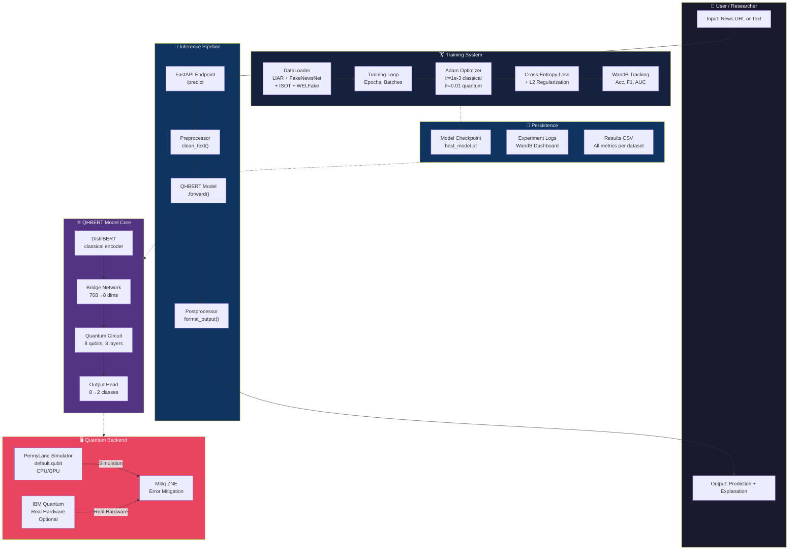
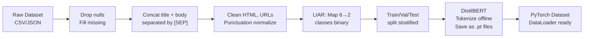
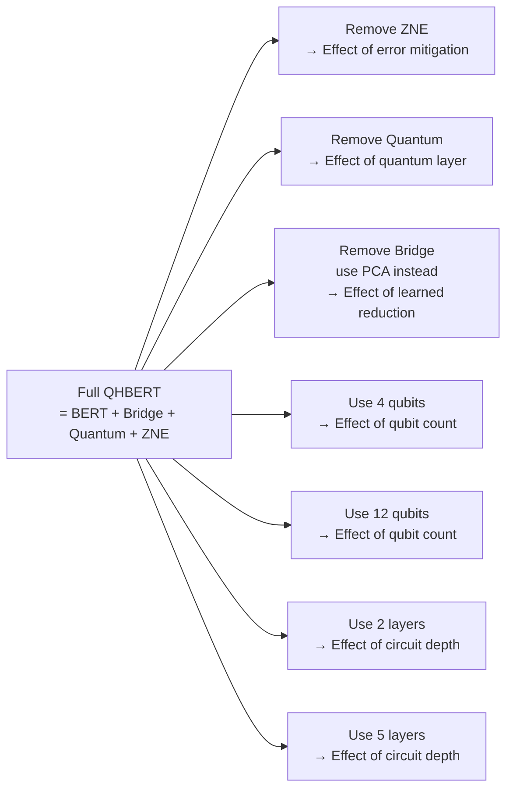
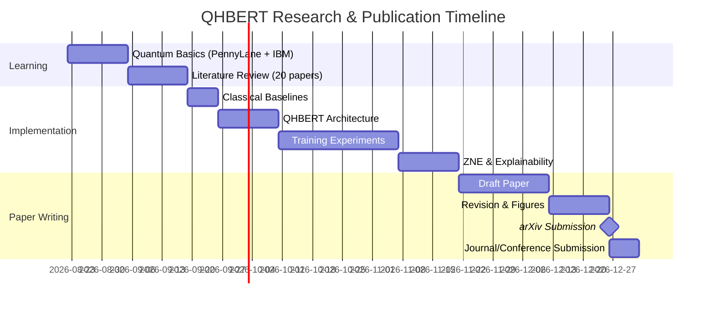

# 🔬 QHBERT: Quantum-Hybrid BERT for Fake News Detection
## Complete Implementation Milestone Document

> **Author**: Jayesh Pandey | **Project**: Quantum Fake News Detection | **Goal**: Research Paper Publication
> **Prior Work**: [github.com/jayeshpandey01/fake_news](https://github.com/jayeshpandey01/fake_news) (Classical Baseline)

---

## 📑 Table of Contents

1. [Research Foundation](#-1-research-foundation)
2. [Literature Review & Key Papers](#-2-literature-review--key-papers)
3. [Research Gap & Novelty](#-3-research-gap--novelty)
4. [System Architecture](#-4-system-architecture)
5. [Quantum Circuit Design](#-5-quantum-circuit-design)
6. [Data Flow Diagram](#-6-data-flow-diagram)
7. [Full System Design](#-7-full-system-design)
8. [Datasets Strategy](#-8-datasets-strategy)
9. [Implementation Milestones](#-9-implementation-milestones)
10. [Benchmarking Plan](#-10-benchmarking-plan)
11. [Project Folder Structure](#-11-project-folder-structure)
12. [Paper Publication Roadmap](#-12-paper-publication-roadmap)

---

## 🧠 1. Research Foundation

### 1.1 Problem Statement

Fake news has become a global crisis causing political instability, public health misinformation, and societal division. Classical machine learning models — while effective — face three fundamental limitations:

| Limitation | Why It Matters |
|---|---|
| **Curse of Dimensionality** | Text features exist in 768–4096 dimensional spaces; classical kernels become exponentially expensive |
| **Non-linear Semantic Entanglement** | Fake news exploits subtle linguistic relationships that classical models miss |
| **Adversarial Brittleness** | BERT-based models are easily fooled by paraphrasing attacks |
| **Parameter Inefficiency** | BERT has 110M parameters; quantum circuits can learn with ~100–500 parameters |

### 1.2 Why Quantum Computing?

Quantum computing operates on principles of **superposition**, **entanglement**, and **quantum interference** — all of which have natural analogies in language:

```
Superposition   ↔  A word can have multiple meanings simultaneously
Entanglement    ↔  Words in a sentence are semantically coupled (context)
Interference    ↔  Contradictory signals cancel out (like detecting inconsistency)
```

A quantum circuit operating on text features doesn't just look at individual words — it processes the **quantum state of the entire sentence simultaneously**, potentially capturing semantic patterns classical models cannot.

### 1.3 What is NISQ-Era Quantum Computing?

NISQ = **Noisy Intermediate-Scale Quantum** (50–1000 qubits, with noise)

```
   Classical Era          NISQ Era (NOW)         Fault-Tolerant Era (Future)
   ─────────────          ──────────────         ──────────────────────────
   No quantum at all      50-1000 qubits         Millions of logical qubits
   All classical ML       Hybrid QML models      Full quantum advantage
   BERT, GPT etc.         VQC + Classical         Native QNN for NLP
                          ← WE ARE HERE →
```

Our project operates in the **NISQ era** — meaning we use hybrid quantum-classical models that are practical on today's hardware.

---

## 📚 2. Literature Review & Key Papers

### 2.1 Foundation Papers (Must-Read First)

| # | Paper | Authors | Year | Key Concept | arXiv ID |
|---|---|---|---|---|---|
| 1 | Quantum Machine Learning | Biamonte et al. | 2017 | QML foundations, exponential speedup theory | `1611.09347` |
| 2 | Quantum Natural Language Processing | Coecke, de Felice et al. | 2020 | DisCoCat model, grammar → quantum circuits | `2012.03755` |
| 3 | Supervised Learning with Quantum-Enhanced Feature Spaces | Havlíček et al. (IBM) | 2019 | ZZ feature map + VQC, real IBM hardware demo | `1804.11326` |
| 4 | Quantum Kernel Methods | Schuld & Killoran | 2019 | Quantum kernels outperform classical | `1803.07128` |
| 5 | QSVMs for Big Data | Rebentrost, Mohseni, Lloyd | 2014 | QSVM exponential speedup proof | `1307.0471` |

### 2.2 QML for Fake News (Your Direct Competition)

| # | Paper | Method | Dataset | Best Result | Gap |
|---|---|---|---|---|---|
| 6 | HQDNN (MDPI *Appl. Sci.*, 2025) | DistilBERT + 2-qubit PQC | LIAR | 94.40% recall (56.5% acc.) | Single dataset, only 2 qubits, no error mitigation |
| 7 | PegasosQSVM (TandF, 2025) | Quantum SVM | BuzzFeed | 96.76% F1 | Metadata-based (not content) |
| 8 | QEMF (*Sigma J. Eng. Nat. Sci.*, 2024) | Multimodal quantum fusion (GloVe+VGG16) | FakeNewsNet | ~88.52% acc (unverified, secondary-source only) | No NISQ hardware validation, qubit count undisclosed |
| 9 | QFAMP (World Scientific, 2024) | Quantum-inspired firefly + ant-miner rule mining | FakeNewsNet | ~87.3% acc (unverified) | Not real quantum circuits — classical metaheuristic only |
| 10 | QCNN-MFND (ACL QuantumNLP Workshop, 2025) | 8-qubit QCNN, multimodal (XLNet+ResNet50) | GossipCop / PolitiFact | 88.52% acc (GossipCop) / 85.58% acc (PolitiFact) | No ZNE; PolitiFact set is tiny (381 train samples) |

### 2.3 QNLP & Text Classification Papers

| # | Paper | Method | Key Takeaway |
|---|---|---|---|
| 11 | QSANN (2023) | Quantum Self-Attention | Self-attention is possible in quantum circuits |
| 12 | LexiQL (SC24, ACM/IEEE, 2024) | Noise-aware QNLP | Design circuits for NISQ noise from the start (no public arXiv preprint — paywalled) |
| 13 | lambeq library (Kartsaklis, 2021) | QNLP toolkit | Grammar-to-circuit conversion pipeline |
| 14 | NLP vs QNLP comparison (2024) | Benchmark | Quantum competitive only on small/simple datasets; classical trains faster and wins as task complexity grows |
| 15 | Entanglement-Based Attention (QTML 2024; ICLR'25 submission withdrawn) | Quantum transformer | Entanglement-as-attention-score — underperformed classical attention on every tested task (cautionary result) |

### 2.4 Classical Baselines You Must Beat

| # | Paper | Method | Why Important |
|---|---|---|---|
| 16 | BERT (Devlin et al., 2019) | Transformer | Your primary classical baseline, `1810.04805` |
| 17 | RoBERTa (Liu et al., 2019) | Improved BERT | Stronger baseline to include |
| 18 | FAKENEWSNET dataset paper (Shu et al., 2020) | Dataset | Defines FakeNewsNet benchmark |
| 19 | FakeGPT (2023) | LLM-based detection | SOTA classical — you must compare |
| 20 | SAFE: Similarity-Aware Multi-modal (2019) | Multimodal | Classic multimodal baseline |

### 2.5 Research Paper Reading Order for a Beginner

```
Week 1  → Papers #1, #2         (Understand quantum basics for ML)
Week 2  → Papers #3, #4, #5     (VQC and quantum kernels)
Week 3  → Papers #6, #7, #8     (Direct fake news competition)
Week 4  → Papers #9-15          (QNLP methods)
Week 5  → Papers #16-20         (Classical baselines)
```

---

## 🔍 3. Research Gap & Novelty

### 3.1 What No One Has Done (Your Contribution)

```
   Existing Work                        Your Contribution (QHBERT)
   ─────────────                        ──────────────────────────
   HQDNN: DistilBERT + VQC             ✅ DistilBERT + VQC
   → Single dataset (LIAR)             ✅ 4 datasets (LIAR, FakeNewsNet, ISOT, WELFake)
   → No error mitigation               ✅ Zero-Noise Extrapolation (ZNE)
   → No explainability                 ✅ Quantum circuit visualization as explanation
   → No hardware validation            ✅ IBM Quantum (optional real hardware)

   PegasosQSVM: Metadata features      ✅ Pure content-based (no metadata needed)
   → Needs propagation data (likes)    ✅ Works on article text only
   → Not real-time applicable          ✅ Real-time inference possible

   QEMF: Multimodal                    ✅ Text-only (simpler, more reproducible)
   → Complex fusion mechanism          ✅ Clean hybrid architecture
   → No standard dataset               ✅ 4 standard benchmarks
```

### 3.2 Your Novelty Claims

> **Claim 1**: First work to apply ZNE error mitigation to fake news detection with quantum circuits
> **Claim 2**: First multi-dataset quantum benchmark (4 datasets) for fake news
> **Claim 3**: First to use quantum circuit visualization and per-qubit measurement patterns as an explainability aid for fake news detection (descriptive circuit-state analysis, not formal feature-attribution)
> **Claim 4**: Competitive with BERT using ~2200x fewer trainable parameters (~50K vs. 110M)

---

## 🏗️ 4. System Architecture

### 4.1 High-Level QHBERT Architecture

```mermaid
graph TB
    subgraph INPUT["📥 INPUT LAYER"]
        A["Raw News Article\n(Headline + Body)"]
    end

    subgraph CLASSICAL_ENC["🧠 CLASSICAL ENCODER — DistilBERT"]
        B["DistilBERT Tokenizer\n(max_length=512)"]
        C["DistilBERT Model\n66M parameters, frozen"]
        D["CLS Token Embedding\n768-dimensional vector"]
        B --> C --> D
    end

    subgraph DIM_RED["📉 DIMENSIONALITY BRIDGE"]
        E["Linear Projection\n768 → 64"]
        F["Layer Normalization"]
        G["ReLU Activation"]
        H["Linear Projection\n64 → n_qubits=8"]
        I["Tanh × π\nScale to &#91;-π, π&#93;"]
        E --> F --> G --> H --> I
    end

    subgraph QUANTUM["⚛️ QUANTUM PROCESSING CORE — PennyLane"]
        J["Angle Embedding\n8 features → 8 qubits"]
        K["Entangling Layer 1\nCNOT gates on all adjacent qubits"]
        L["Variational Rotation Layer 1\nRY, RZ gates — 16 params"]
        M["Entangling Layer 2\nCNOT gates — ring topology"]
        N["Variational Rotation Layer 2\nRY, RZ gates — 16 params"]
        O["Entangling Layer 3\nCNOT gates"]
        P["Variational Rotation Layer 3\nRY, RZ gates — 16 params"]
        Q["Pauli-Z Measurement\n8 expectation values"]
        J --> K --> L --> M --> N --> O --> P --> Q
    end

    subgraph ZNE["🛡️ ERROR MITIGATION — Mitiq"]
        R["Zero-Noise Extrapolation\nNoise factors: 1×, 2×, 3×"]
        S["Richardson Extrapolation\nEstimate zero-noise output"]
        R --> S
    end

    subgraph CLASSICAL_OUT["🎯 CLASSICAL OUTPUT HEAD"]
        T["Linear Layer\n8 → 16"]
        U["ReLU + Dropout(0.3)"]
        V["Linear Layer\n16 → 2"]
        W["Softmax"]
        T --> U --> V --> W
    end

    subgraph OUTPUT["📤 OUTPUT"]
        X["REAL NEWS 🟢\nor FAKE NEWS 🔴\n+ Confidence Score"]
        Y["Quantum Circuit\nVisualization\n(Explainability)"]
    end

    A --> B
    D --> E
    I --> J
    Q --> R
    S --> T
    W --> X
    Q --> Y

    style INPUT fill:#1a1a2e,color:#fff
    style CLASSICAL_ENC fill:#16213e,color:#fff
    style DIM_RED fill:#0f3460,color:#fff
    style QUANTUM fill:#533483,color:#fff
    style ZNE fill:#e94560,color:#fff
    style CLASSICAL_OUT fill:#0f3460,color:#fff
    style OUTPUT fill:#16213e,color:#fff
```



### 4.2 Component Breakdown

| Component | Technology | Parameters | Purpose |
|---|---|---|---|
| **Tokenizer** | DistilBERT-base-uncased | 0 (fixed) | Convert text to token IDs |
| **Encoder** | DistilBERT (frozen) | 66M (frozen) | Extract semantic embeddings |
| **Bridge Network** | PyTorch Linear + LayerNorm | ~49,864 | Reduce 768→8 dimensions |
| **Quantum Circuit** | PennyLane (8 qubits, 3 layers) | 48 params | Quantum feature transformation |
| **ZNE** | Mitiq library | 0 | Reduce quantum noise |
| **Output Head** | PyTorch Linear | 178 | Binary classification |
| **TOTAL Trainable** | — | **~50,090** | vs BERT's 110M = **~2200× smaller** |

---

## ⚛️ 5. Quantum Circuit Design

### 5.1 The Ansatz (Circuit Structure)

```mermaid
graph LR
    subgraph ENCODE["Data Encoding"]
        Q0["q&#91;0&#93; ─ RY(x₀)"]
        Q1["q&#91;1&#93; ─ RY(x₁)"]
        Q2["q&#91;2&#93; ─ RY(x₂)"]
        Q3["q&#91;3&#93; ─ RY(x₃)"]
        Q4["q&#91;4&#93; ─ RY(x₄)"]
        Q5["q&#91;5&#93; ─ RY(x₅)"]
        Q6["q&#91;6&#93; ─ RY(x₆)"]
        Q7["q&#91;7&#93; ─ RY(x₇)"]
    end

    subgraph LAYER1["Entangling Layer 1"]
        E01["CNOT(0,1)"]
        E12["CNOT(1,2)"]
        E23["CNOT(2,3)"]
        E34["CNOT(3,4)"]
        E45["CNOT(4,5)"]
        E56["CNOT(5,6)"]
        E67["CNOT(6,7)"]
        E70["CNOT(7,0)\nring topology"]
    end

    subgraph VAR1["Variational Layer 1"]
        R0["RY(θ₀)RZ(φ₀)"]
        R1["RY(θ₁)RZ(φ₁)"]
        R2["..."]
        R7["RY(θ₇)RZ(φ₇)"]
    end

    subgraph MEASURE["Measurement"]
        M0["⟨Z₀⟩"]
        M1["⟨Z₁⟩"]
        M7["...⟨Z₇⟩"]
    end

    ENCODE --> LAYER1 --> VAR1
    VAR1 --> |"× 3 layers"| LAYER1
    VAR1 --> MEASURE
```



### 5.2 Circuit in Code (PennyLane)

```python
import pennylane as qml
import numpy as np

n_qubits = 8
n_layers = 3

dev = qml.device("default.qubit", wires=n_qubits)

@qml.qnode(dev, interface="torch")
def quantum_circuit(inputs, weights):
    """
    QHBERT Quantum Circuit
    
    Args:
        inputs  : torch.Tensor of shape (n_qubits,) — scaled to [-π, π]
        weights : torch.Tensor of shape (n_layers, n_qubits, 2) — RY and RZ angles
    
    Returns:
        list of n_qubits expectation values ⟨Z_i⟩
    """
    # ── STEP 1: Data Encoding (Angle Embedding) ──
    qml.AngleEmbedding(inputs, wires=range(n_qubits), rotation='Y')
    
    # ── STEP 2: Variational Layers (Strongly Entangling) ──
    for layer in range(n_layers):
        # Entangling block — ring topology
        for i in range(n_qubits):
            qml.CNOT(wires=[i, (i + 1) % n_qubits])
        
        # Parameterized rotations
        for qubit in range(n_qubits):
            qml.RY(weights[layer, qubit, 0], wires=qubit)
            qml.RZ(weights[layer, qubit, 1], wires=qubit)
    
    # ── STEP 3: Measurement ──
    return [qml.expval(qml.PauliZ(i)) for i in range(n_qubits)]

# Weight shape: (n_layers=3, n_qubits=8, 2_rotations) = 48 parameters
weight_shapes = {"weights": (n_layers, n_qubits, 2)}
```

### 5.3 Why This Circuit Design?

| Design Choice | Reason |
|---|---|
| **Angle Embedding** | Best for small-dim classical features; maps naturally to qubit rotations |
| **Ring CNOT topology** | Matches IBM Eagle processor connectivity; reduces SWAP gates |
| **3 layers** | Enough expressivity; avoids barren plateau with small depth |
| **RY + RZ per qubit** | 2 degrees of freedom per qubit = maximum expressibility per parameter |
| **Pauli-Z measurement** | Standard, maps qubit to [-1, +1] range for classical layer |

---

## 🌊 6. Data Flow Diagram

```mermaid
flowchart TD
    A["📰 Raw News Article\n'Scientists say 5G causes...'\nHeadline + Body text"] 
    
    B["🔤 Preprocessing\n• Remove HTML tags\n• Lowercase\n• Remove URLs\n• Clean punctuation"]
    
    C["🏷️ DistilBERT Tokenizer\n• Tokenize → token IDs\n• Add [CLS], [SEP]\n• Truncate/pad to 512"]
    
    D["🧠 DistilBERT Forward Pass\nFrozen weights — no gradient\nOutput: last_hidden_state"]
    
    E["📌 CLS Token Extraction\nlast_hidden_state&#91;:, 0, :&#93;\nShape: batch × 768"]
    
    F["📉 Linear Bridge Network\n768 → 64 → 8\n+ LayerNorm + ReLU\nShape: batch × 8"]
    
    G["📐 Quantum Scaling\nTanh × π\nRange: &#91;-π, π&#93;\nShape: batch × 8"]
    
    H["⚛️ Quantum Circuit\n8 inputs → 8 qubits\nAngle Embed → 3×&#40;CNOT+RY+RZ&#41;\nMeasure ⟨Z_i⟩\nShape: batch × 8"]
    
    I{"🛡️ ZNE Active?\nOnly during evaluation\non real hardware"}
    
    J["🛡️ ZNE Mitigation\nRun at noise×1, ×2, ×3\nRichardson extrapolation\n→ zero-noise estimate"]
    
    K["🎯 Classical Head\n8 → 16 &#40;ReLU + Dropout&#41;\n16 → 2 &#40;Logits&#41;\n2 → Softmax probabilities"]
    
    L["📊 Output\nP&#40;FAKE&#41; | P&#40;REAL&#41;\nPrediction + Confidence"]
    
    M["📈 Loss & Backprop\nCross-Entropy Loss\nAdam optimizer\n∂L/∂θ via parameter shift rule"]

    A --> B --> C --> D --> E --> F --> G --> H --> I
    I -->|"Yes"| J --> K
    I -->|"No"| K
    K --> L
    L -->|"During Training"| M
    M -->|"Update quantum θ\n+ classical weights"| F
```



---

## 🏛️ 7. Full System Design

### 7.1 End-to-End System Architecture



### 7.2 Training System Design

```mermaid
sequenceDiagram
    participant DS as 📂 Dataset
    participant DL as 🔄 DataLoader
    participant BERT as 🧠 DistilBERT
    participant BRIDGE as 📉 Bridge Net
    participant QC as ⚛️ Quantum Circuit
    participant LOSS as 📊 Loss Fn
    participant OPT as ⚙️ Optimizer
    participant WB as 📈 WandB

    loop Every Epoch
        DS->>DL: Shuffle & batch articles
        DL->>BERT: batch_input_ids, attention_mask
        BERT->>BRIDGE: 768-dim CLS embeddings
        BRIDGE->>QC: 8-dim scaled features
        Note over QC: Angle Embed → CNOT → RY/RZ × 3
        QC->>LOSS: 8 expectation values ⟨Z⟩
        LOSS->>OPT: Cross-entropy gradient
        Note over OPT: Parameter shift rule for ∂L/∂θ_quantum
        OPT->>BRIDGE: Update bridge weights (Adam)
        OPT->>QC: Update quantum angles θ (Adam)
        OPT->>WB: Log metrics every step
        WB-->>DS: Checkpoint if val_F1 improves
    end
```

---

## 📦 8. Datasets Strategy

### 8.1 Dataset Overview

| Dataset | Articles | Classes | Avg Length | Source | Split |
|---|---|---|---|---|---|
| **LIAR** | 12,836 | 6→Binary | Short (1-2 sentences) | PolitiFact | 70/10/20 |
| **FakeNewsNet** | 23,196 | Binary | Medium (full articles) | GossipCop + PolitiFact | 70/10/20 |
| **ISOT** | 44,898 | Binary | Long (full articles) | UVic + Reuters | 70/15/15 |
| **WELFake** | 72,134 | Binary | Medium (merged) | Kaggle (4 sources) | 70/15/15 |

### 8.2 How to Download Each Dataset

```bash
# LIAR Dataset (via HuggingFace Datasets)
# NOTE: requires datasets<4.0 — the 'liar' dataset card uses a legacy loading
# script (liar.py); datasets>=4.0 removed support for script-based loaders.
pip install "datasets<4.0"
python -c "from datasets import load_dataset; ds = load_dataset('liar'); ds.save_to_disk('./data/liar')"

# FakeNewsNet (KaiDMML GitHub)
git clone https://github.com/KaiDMML/FakeNewsNet.git
cd FakeNewsNet && pip install -r requirements.txt

# ISOT (Kaggle)
pip install kaggle
kaggle datasets download -d csmalarkodi/isot-fake-news-dataset -p ./data/isot

# WELFake (Kaggle)
kaggle datasets download -d saurabhshahane/fake-news-classification -p ./data/welfake
```

### 8.3 Dataset Preprocessing Pipeline



---

## 🗓️ 9. Implementation Milestones

> Follow this order **strictly**. Each milestone builds on the previous. Do NOT skip ahead.

---

### 🎯 MILESTONE 0 — Environment Setup (Day 1–2)

**Goal**: Get your development environment fully working.

```bash
# Create conda environment
conda create -n qfakenews python=3.10
conda activate qfakenews

# Core ML
pip install torch torchvision torchaudio --index-url https://download.pytorch.org/whl/cpu
pip install transformers "datasets<4.0" scikit-learn pandas numpy matplotlib seaborn
# NOTE: datasets>=4.0 dropped support for script-based dataset loaders (e.g. LIAR's
# liar.py), so pin datasets<4.0 or load_dataset('liar') will raise a RuntimeError.

# Quantum
pip install pennylane pennylane-qiskit
pip install qiskit qiskit-machine-learning qiskit-ibm-runtime

# Error mitigation
pip install mitiq

# QNLP (optional, for later)
pip install lambeq

# Experiment tracking
pip install wandb

# Utilities
pip install jupyter tqdm rich
```

**Checkpoint**: Run this test —
```python
import pennylane as qml
import torch
dev = qml.device("default.qubit", wires=2)

@qml.qnode(dev)
def test_circuit():
    qml.Hadamard(wires=0)
    qml.CNOT(wires=[0, 1])
    return qml.expval(qml.PauliZ(0))

print("✅ Quantum OK:", test_circuit())  # Should print ~0.0
```

---

### 🎯 MILESTONE 1 — Quantum Computing Fundamentals (Week 1–2)

**Goal**: Understand quantum computing well enough to read the papers and explain your model.

**Learning Tasks**:
- [ ] Complete [PennyLane Codebook](https://pennylane.ai/codebook) — Modules I, II, III
- [ ] Complete [IBM Quantum Learning](https://learning.quantum.ibm.com) — "Basics of Quantum Information"
- [ ] Build and run a Variational Quantum Classifier on the **Iris dataset**

**Milestone Code**:
```python
# File: milestones/m1_iris_vqc.py
# Your first working VQC — classify Iris flowers
import pennylane as qml
import numpy as np
from sklearn.datasets import load_iris
from sklearn.preprocessing import normalize

n_qubits = 4
dev = qml.device("default.qubit", wires=n_qubits)

@qml.qnode(dev)
def vqc(x, weights):
    qml.AngleEmbedding(x, wires=range(n_qubits))
    qml.BasicEntanglerLayers(weights, wires=range(n_qubits))
    return qml.expval(qml.PauliZ(0))

# Train this → your first quantum ML model!
```

**Deliverable**: A Jupyter notebook `01_quantum_basics.ipynb` with:
- [ ] Bloch sphere visualization of a qubit
- [ ] Your VQC trained on Iris with accuracy > 85%
- [ ] Written explanation: "What is superposition in my own words"

---

### 🎯 MILESTONE 2 — Literature Review & Research Gap (Week 2–3)

**Goal**: Read all 20 papers. Build your related work comparison table.

**Tasks**:
- [ ] Read papers #1–5 (foundations) — take notes on key equations
- [ ] Read papers #6–10 (competition) — note their accuracy numbers
- [ ] Read papers #11–15 (QNLP methods)
- [ ] Read papers #16–20 (classical baselines)

**Deliverable**: A markdown file `02_literature_review.md` with:
- [ ] Summary of each paper (3–5 sentences)
- [ ] "Research Gap" section: What YOUR paper adds that no one else has done

---

### 🎯 MILESTONE 3 — Classical Baseline (Week 3–4)

**Goal**: Reproduce the classical baselines. These are your benchmarks.

**Targets**:
```
TF-IDF + Logistic Regression  → LIAR ~60%
TF-IDF + SVM (RBF)            → LIAR ~62%
DistilBERT fine-tuned          → LIAR ~70-75%
```

**Code**:
```python
# File: milestones/m3_classical_baselines.py

from transformers import DistilBertForSequenceClassification, Trainer, TrainingArguments
from datasets import load_dataset

# 1. TF-IDF + SVM baseline
from sklearn.feature_extraction.text import TfidfVectorizer
from sklearn.svm import SVC
from sklearn.metrics import f1_score, accuracy_score

# Load LIAR
ds = load_dataset("liar")
# Map 6-class to binary: 0 (true/mostly-true/half-true) → 0, rest → 1
label_map = {"true": 0, "mostly-true": 0, "half-true": 0,
             "barely-true": 1, "false": 1, "pants-fire": 1}

X_train = [ex["statement"] for ex in ds["train"]]
y_train = [label_map[ex["label"]] for ex in ds["train"]]
X_test  = [ex["statement"] for ex in ds["test"]]
y_test  = [label_map[ex["label"]] for ex in ds["test"]]

vectorizer = TfidfVectorizer(max_features=5000)
X_train_vec = vectorizer.fit_transform(X_train)
X_test_vec  = vectorizer.transform(X_test)

clf = SVC(kernel='rbf', C=1.0)
clf.fit(X_train_vec, y_train)
preds = clf.predict(X_test_vec)

print(f"SVM Accuracy: {accuracy_score(y_test, preds):.4f}")
print(f"SVM F1:       {f1_score(y_test, preds):.4f}")
```

**Deliverable**: Notebook `03_classical_baselines.ipynb` with all baseline results logged to WandB.

---

### 🎯 MILESTONE 4 — Hybrid QHBERT Architecture (Week 4–6)

**Goal**: Implement the full QHBERT model.

**Files to create**:
```
src/
├── models/
│   ├── qhbert.py          ← Main model class
│   ├── quantum_circuit.py ← PennyLane circuit
│   └── bridge.py          ← Classical bridge network
├── data/
│   ├── dataset.py         ← PyTorch Dataset class
│   └── preprocess.py      ← Cleaning pipeline
└── train.py               ← Training loop
```

**Core Model Code**:
```python
# File: src/models/qhbert.py
import torch
import torch.nn as nn
import pennylane as qml

class QuantumLayer(nn.Module):
    """Parameterized Quantum Circuit as a PyTorch layer."""
    
    def __init__(self, n_qubits=8, n_layers=3):
        super().__init__()
        self.n_qubits = n_qubits
        self.dev = qml.device("default.qubit", wires=n_qubits)
        
        # Define quantum circuit
        @qml.qnode(self.dev, interface="torch", diff_method="parameter-shift")
        def circuit(inputs, weights):
            qml.AngleEmbedding(inputs, wires=range(n_qubits), rotation='Y')
            for layer in range(n_layers):
                for i in range(n_qubits):
                    qml.CNOT(wires=[i, (i + 1) % n_qubits])
                for qubit in range(n_qubits):
                    qml.RY(weights[layer, qubit, 0], wires=qubit)
                    qml.RZ(weights[layer, qubit, 1], wires=qubit)
            return [qml.expval(qml.PauliZ(i)) for i in range(n_qubits)]
        
        self.qlayer = qml.qnn.TorchLayer(
            circuit,
            weight_shapes={"weights": (n_layers, n_qubits, 2)}
        )
    
    def forward(self, x):
        return self.qlayer(x)


class QHBERT(nn.Module):
    """
    Quantum-Hybrid BERT for Fake News Detection.
    
    Architecture:
        DistilBERT (frozen) → Bridge Network → Quantum Circuit → Output Head
    """
    
    def __init__(self, n_qubits=8, n_layers=3, num_labels=2, dropout=0.3):
        super().__init__()
        
        from transformers import DistilBertModel
        
        # Classical encoder (frozen)
        self.bert = DistilBertModel.from_pretrained('distilbert-base-uncased')
        for param in self.bert.parameters():
            param.requires_grad = False  # Freeze BERT
        
        # Bridge network: 768 → n_qubits
        self.bridge = nn.Sequential(
            nn.Linear(768, 64),
            nn.LayerNorm(64),
            nn.ReLU(),
            nn.Dropout(dropout),
            nn.Linear(64, n_qubits),
        )
        
        # Quantum layer
        self.quantum = QuantumLayer(n_qubits, n_layers)
        
        # Output head
        self.classifier = nn.Sequential(
            nn.Linear(n_qubits, 16),
            nn.ReLU(),
            nn.Dropout(dropout),
            nn.Linear(16, num_labels),
        )
    
    def forward(self, input_ids, attention_mask):
        # 1. Classical encoding
        with torch.no_grad():
            bert_out = self.bert(input_ids=input_ids,
                                 attention_mask=attention_mask)
        cls_embedding = bert_out.last_hidden_state[:, 0, :]  # CLS token
        
        # 2. Dimensionality reduction
        reduced = self.bridge(cls_embedding)
        scaled = torch.tanh(reduced) * torch.pi  # Scale to [-π, π]
        
        # 3. Quantum processing (batch-wise)
        quantum_out = torch.stack([self.quantum(scaled[i]) 
                                   for i in range(scaled.shape[0])])
        
        # 4. Classification
        logits = self.classifier(quantum_out)
        return logits
```

**Deliverable**: Working model that can do a forward pass without errors.

---

### 🎯 MILESTONE 5 — Training & Experiments (Week 6–10)

**Goal**: Train on all 4 datasets. Beat classical baselines.

**Training Loop**:
```python
# File: src/train.py
import torch
import wandb
from torch.optim import Adam
from torch.nn import CrossEntropyLoss
from sklearn.metrics import f1_score, accuracy_score

def train(model, train_loader, val_loader, config):
    wandb.init(project="qhbert-fakenews", config=config)
    
    # Separate LR for quantum vs classical params
    quantum_params = list(model.quantum.parameters())
    classical_params = list(model.bridge.parameters()) + \
                       list(model.classifier.parameters())
    
    optimizer = Adam([
        {"params": classical_params, "lr": config["lr_classical"]},  # 1e-3
        {"params": quantum_params,   "lr": config["lr_quantum"]},    # 1e-2
    ])
    
    criterion = CrossEntropyLoss()
    best_f1 = 0
    
    for epoch in range(config["epochs"]):
        model.train()
        for batch in train_loader:
            optimizer.zero_grad()
            logits = model(batch["input_ids"], batch["attention_mask"])
            loss = criterion(logits, batch["labels"])
            loss.backward()
            optimizer.step()
            wandb.log({"train_loss": loss.item()})
        
        # Validation
        val_f1, val_acc = evaluate(model, val_loader)
        wandb.log({"val_f1": val_f1, "val_acc": val_acc, "epoch": epoch})
        
        if val_f1 > best_f1:
            best_f1 = val_f1
            torch.save(model.state_dict(), "best_model.pt")
            print(f"✅ Epoch {epoch}: New best F1 = {val_f1:.4f}")
```

**Experiments to run**:
- [ ] Exp-1: QHBERT on LIAR (binary)
- [ ] Exp-2: QHBERT on FakeNewsNet
- [ ] Exp-3: QHBERT on ISOT
- [ ] Exp-4: QHBERT on WELFake
- [ ] Exp-5: Ablation — Remove quantum layer (just BERT + bridge + head)
- [ ] Exp-6: Ablation — Add ZNE mitigation
- [ ] Exp-7: Hyperparameter sweep: n_qubits ∈ {4, 8, 12}, n_layers ∈ {2, 3, 4}

---

### 🎯 MILESTONE 6 — Error Mitigation & Explainability (Week 10–12)

**Goal**: Add ZNE and quantum circuit visualization.

**ZNE Integration**:
```python
# File: src/mitigation/zne.py
import mitiq
import pennylane as qml

def apply_zne(circuit_fn, executor, noise_factors=[1, 2, 3]):
    """Apply Zero-Noise Extrapolation to a quantum circuit."""
    return mitiq.zne.execute_with_zne(
        circuit=circuit_fn,
        executor=executor,
        factory=mitiq.zne.inference.RichardsonFactory(noise_factors)
    )
```

**Explainability — Circuit Visualization**:
```python
# File: src/explain.py
import pennylane as qml
import matplotlib.pyplot as plt

def explain_prediction(model, text, tokenizer):
    """
    Visualize the quantum circuit state for a prediction.
    Shows which qubits 'activate' for real vs fake news.
    """
    inputs = tokenizer(text, return_tensors='pt', 
                       max_length=512, truncation=True, padding=True)
    
    with torch.no_grad():
        bert_out = model.bert(**inputs).last_hidden_state[:, 0, :]
        reduced = model.bridge(bert_out)
        scaled = torch.tanh(reduced) * torch.pi
    
    # Draw the quantum circuit with actual input values
    fig, ax = qml.draw_mpl(model.quantum.qlayer.qnode)(
        scaled[0], 
        model.quantum.qlayer.weights
    )
    ax.set_title(f"Quantum Circuit State for:\n'{text[:60]}...'")
    plt.savefig("circuit_explanation.png", dpi=150, bbox_inches='tight')
    return fig
```

---

### 🎯 MILESTONE 7 — Paper Writing (Week 12–16)

See Section 12 below.

---

## 📊 10. Benchmarking Plan

### 10.1 Metrics

| Metric | Formula | Why |
|---|---|---|
| **Accuracy** | (TP+TN)/(TP+FP+TN+FN) | General performance |
| **F1-Score** | 2PR/(P+R) | Handles class imbalance |
| **AUC-ROC** | Area under ROC curve | Threshold-independent |
| **Precision** | TP/(TP+FP) | Minimizes false positives |
| **Recall** | TP/(TP+FN) | Minimizes false negatives |

### 10.2 Results Table (Fill as you experiment)

| Model | LIAR F1 | FNN F1 | ISOT F1 | WELFake F1 | Params | Notes |
|---|---|---|---|---|---|---|
| TF-IDF + LR | — | — | — | — | — | Baseline 1 |
| TF-IDF + SVM | — | — | — | — | — | Baseline 2 |
| DistilBERT | — | — | — | — | 66M | Baseline 3 |
| BERT-base | — | — | — | — | 110M | Baseline 4 |
| HQDNN (repro.) | — | — | — | — | — | Prior QML |
| **QHBERT (ours)** | — | — | — | — | ~50K | **No ZNE** |
| **QHBERT+ZNE (ours)** | — | — | — | — | ~50K | **With ZNE** |

### 10.3 Ablation Study Design



---

## 📁 11. Project Folder Structure

```
quantum_fake_news/
│
├── 📂 data/
│   ├── raw/               ← Downloaded datasets (don't modify)
│   │   ├── liar/
│   │   ├── fakenewsnet/
│   │   ├── isot/
│   │   └── welfake/
│   ├── processed/         ← Cleaned & tokenized (cached .pt files)
│   └── splits/            ← Train/val/test CSVs
│
├── 📂 src/
│   ├── models/
│   │   ├── qhbert.py          ← Main QHBERT model
│   │   ├── quantum_circuit.py ← PennyLane circuit definition
│   │   ├── bridge.py          ← Classical bridge network
│   │   └── baselines.py       ← Classical baseline models
│   ├── data/
│   │   ├── dataset.py         ← PyTorch Dataset classes
│   │   ├── preprocess.py      ← Text cleaning pipeline
│   │   └── loaders.py         ← DataLoader factory
│   ├── training/
│   │   ├── train.py           ← Training loop
│   │   ├── evaluate.py        ← Metrics computation
│   │   └── config.py          ← Hyperparameter configs
│   ├── mitigation/
│   │   └── zne.py             ← ZNE error mitigation
│   └── explain/
│       └── visualize.py       ← Circuit visualization, SHAP
│
├── 📂 milestones/             ← One notebook per milestone
│   ├── 00_environment_test.ipynb
│   ├── 01_quantum_basics.ipynb
│   ├── 02_literature_review.md
│   ├── 03_classical_baselines.ipynb
│   ├── 04_qhbert_architecture.ipynb
│   ├── 05_experiments.ipynb
│   └── 06_paper_figures.ipynb
│
├── 📂 experiments/            ← All experiment results
│   ├── exp1_liar/
│   ├── exp2_fakenewsnet/
│   ├── exp3_isot/
│   ├── exp4_welfake/
│   └── ablations/
│
├── 📂 paper/                  ← Paper writing
│   ├── main.tex
│   ├── figures/
│   │   ├── architecture.pdf
│   │   ├── quantum_circuit.pdf
│   │   └── results_table.pdf
│   └── references.bib
│
├── 📂 tests/                  ← Unit tests
│   ├── test_circuit.py
│   ├── test_model.py
│   └── test_data.py
│
├── requirements.txt
├── README.md
├── .gitignore
└── setup.py
```

---

## 📝 12. Paper Publication Roadmap

### 12.1 Paper Structure

```
Title: "QHBERT: A Noise-Mitigated Hybrid Quantum-Classical 
        Transformer for Fake News Detection Across Multiple Benchmarks"

Abstract        150 words  — Problem → Method → Results → Contribution
1. Introduction  1.5 pages  — Motivation, contributions (4 bullet points)
2. Background    1.5 pages  — Quantum computing + QML basics
3. Related Work  1.5 pages  — 20 papers → your gap
4. Methodology   2.5 pages  — Architecture + circuit + ZNE + training
5. Experiments   2.5 pages  — 4 datasets + ablations + hardware
6. Discussion    1 page     — Interpretation + limitations
7. Conclusion    0.5 page   — Summary + future work
References       20–35 papers
```

### 12.2 Figure Checklist

- [ ] **Fig 1**: QHBERT architecture diagram (from Section 4.1)
- [ ] **Fig 2**: Quantum circuit diagram (from Section 5.1)
- [ ] **Fig 3**: Training loss curves (classical vs quantum loss)
- [ ] **Fig 4**: Results table (all datasets, all models)
- [ ] **Fig 5**: Ablation study bar chart
- [ ] **Fig 6**: Sample quantum circuit visualization (explainability)
- [ ] **Fig 7**: t-SNE of quantum features vs classical features

### 12.3 Where to Submit (Priority Order)

```
Step 1: Post to arXiv (cs.CL + quant-ph) ← DO THIS FIRST
         Establishes priority. Free. Gets you cited.

Step 2: Submit to conference (parallel)
         → ACL/EMNLP Quantum NLP Workshop (6 months timeline)
         → IEEE QCNC 2026 (quantum-specific)

Step 3: Submit to journal (while waiting for conference)
         → MDPI Entropy (fast, open access, peer-reviewed)
         → IEEE Access (fast, reputable)

Step 4: If results are strong
         → NPJ Quantum Information (Nature portfolio — best)
         → IEEE TNNLS (high impact)
```

### 12.4 Timeline Overview



---

## ✅ Master Checklist

### Milestone Progress Tracker

- [ ] **M0** — Environment setup & hello quantum circuit
- [ ] **M1** — VQC on Iris dataset working (>85% accuracy)
- [ ] **M1** — All 20 papers read with notes
- [ ] **M2** — Literature review markdown written
- [ ] **M3** — Classical baselines run on LIAR (SVM, BERT)
- [ ] **M3** — All baselines logged to WandB
- [ ] **M4** — QHBERT forward pass working
- [ ] **M4** — Training loop running without errors
- [ ] **M5** — Experiments on all 4 datasets complete
- [ ] **M5** — Ablation study complete
- [ ] **M6** — ZNE integrated and tested
- [ ] **M6** — Circuit visualization working
- [ ] **M7** — All paper figures generated
- [ ] **M7** — Paper draft complete
- [ ] **M7** — arXiv submission done
- [ ] **M7** — Journal/conference submission done 🎉

---

> [!IMPORTANT]
> **Your classical repo** (`github.com/jayeshpandey01/fake_news`) becomes **Baseline 3** in your paper.
> Never delete it — it proves you started from classical and evolved to quantum. That's your research story.

> [!TIP]
> **Start Day 1 with ONE thing**: `pip install pennylane` then run the 4-line quantum circuit test from Milestone 0. 
> Every quantum paper ever written started with someone running their first qubit. That's your beginning.

---

*Document Version 1.0 | QHBERT Implementation Milestones | August 2026*
